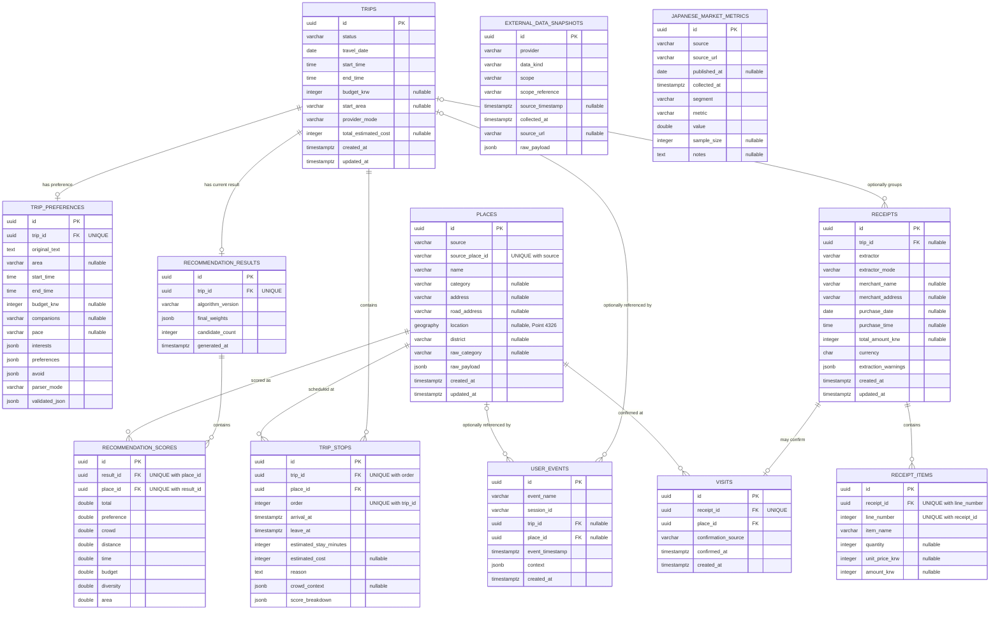

# 데이터 모델

## 규칙

현재 백엔드는 PostgreSQL/PostGIS용 TypeORM entity를 사용한다. Entity 속성은 camelCase를 사용하고 snake_case table/column에 대응한다. ID는 UUID이며 audit timestamp는 `timestamptz`다. `travel_date`, `start_time`, `end_time`은 서울 여행 일정을 나타내고, 경로에 배치된 경유지의 도착·출발 값은 절대 timestamp로 저장한다.

Provider field가 없으면 nullable 상태를 유지한다. 현재 `Place` entity는 최신 정규화 record와 해당 `raw_payload`를 보관한다. `ExternalDataSnapshot`은 별도로 수집한 시간 범위 기반 장소·혼잡도·시장 payload를 독립적으로 모델링한다. 어떤 field도 normalizer가 누락된 값을 만들어 내는 것을 허용하지 않는다.

아래 내용은 현재 `backend/src/database/entities`에 존재하는 entity class를 설명한다. Database migration과 추가적인 database 수준 제약 조건도 이 내용과 일치하도록 유지해야 한다.

## 관계

```text
Trip 1--1 TripPreference
Trip 1--* TripStop *--1 Place
Trip 1--1 RecommendationResult 1--* RecommendationScore *--1 Place

ExternalDataSnapshot       범위 참조로 연결되는 출처 레코드
JapaneseMarketMetric       집계된 Cold Start 데이터 출처
UserEvent                  2단계 호환 익명 이벤트
Trip 1--* Receipt 1--* ReceiptItem
Receipt 1--0..1 Visit *--1 Place
```

## ERD

아래 ERD는 현재 적용된 TypeORM migration의 애플리케이션 테이블 12개와 실제 외래키를 기준으로 한다. `ExternalDataSnapshot`과 `JapaneseMarketMetric`은 출처 추적용 독립 테이블이며 다른 테이블에 대한 외래키가 없다.



현재 MVP model은 여행당 추천 결과 하나를 유지한다. 재계산은 여러 과거 결과 version을 보존하는 대신 현재 여행 경로를 갱신하거나 교체한다. Version별 결과 이력은 추후 audit 개선 사항이며 구현된 것으로 설명해서는 안 된다.

## 핵심 entity

### `trips`

| 컬럼 | 타입 | 현재 의미 |
| --- | --- | --- |
| `id` | `uuid` | primary key |
| `status` | `varchar(24)` | 내부 상태 `generating`, `ready`, `modified`, `failed`; 성공한 API 조회는 `ready`/`modified` 반환 |
| `travel_date` | `date` | 서울 기준 달력 날짜 |
| `start_time` | `time` | 요청된 시작 시간 |
| `end_time` | `time` | 요청된 종료 시간 |
| `budget_krw` | `integer`, nullable | 검증된 정수 KRW |
| `start_area` | `varchar(120)`, nullable | 명시적으로 입력하거나 파싱한 지역 |
| `provider_mode` | `varchar(8)` | 여행 단위 `mock` 또는 `live` 표시 |
| `total_estimated_cost` | `integer`, nullable | 완전한 추정치를 계산할 수 없으면 null |
| `created_at` | `timestamptz` | TypeORM이 생성 |
| `updated_at` | `timestamptz` | TypeORM이 생성 |

`Trip`에서 하나의 preference, 여러 stop, 하나의 recommendation result로 관계가 cascade된다. Request DTO/API 이름은 `travelDate`와 `budget`을 사용하고, 영속화 이름에는 domain 단위를 명시적으로 유지한다.

### `trip_preferences`

고유한 `trip_id`를 통해 `Trip`과 일대일 관계를 맺는다.

| 컬럼 | 타입 | 현재 의미 |
| --- | --- | --- |
| `id` | `uuid` | primary key |
| `trip_id` | `uuid` | unique FK, cascade delete |
| `original_text` | `text` | 사용자의 요청 |
| `area` | `varchar(120)`, nullable | 정규화된 서울 지역 |
| `start_time` / `end_time` | `time` | 검증된 시간 범위 |
| `budget_krw` | `integer`, nullable | 정수 KRW |
| `companions` / `pace` | `varchar(40)`, nullable | parser 출력 |
| `interests` | `jsonb` | 정규화된 문자열 배열, 기본값 `[]` |
| `preferences` | `jsonb` | 정규화된 문자열 배열, 기본값 `[]` |
| `avoid` | `jsonb` | 정규화된 문자열 배열, 기본값 `[]` |
| `parser_mode` | `varchar(8)` | `mock` 또는 `live` |
| `validated_json` | `jsonb` | 명시적 override 적용 후 검증된 정확한 결과 |

`validated_json`은 audit snapshot이며 경로 또는 순위 계산을 지시하는 channel이 아니다. `validated_json`과 `original_text` 모두 production 적용 전에 보존 정책이 필요하다.

### `places`

한 row는 하나의 Provider identity를 나타낸다.

| 컬럼 | 타입 | 현재 의미 |
| --- | --- | --- |
| `id` | `uuid` | primary key |
| `source` | `varchar(40)` | Provider 이름 |
| `source_place_id` | `varchar(255)` | Provider가 제공했거나 명시적으로 파생 표시된 identity |
| `name` | `varchar(255)` | Provider 기반 이름 |
| `category` | `varchar(120)`, nullable | canonical category |
| `address` | `varchar(500)`, nullable | Provider 값 |
| `road_address` | `varchar(500)`, nullable | Provider 값 |
| `location` | `geography(Point,4326)`, nullable | WGS84 `[longitude, latitude]` |
| `district` | `varchar(80)`, nullable | 확인된 경우 정규화한 자치구 |
| `raw_category` | `varchar(500)`, nullable | Provider category |
| `raw_payload` | `jsonb` | 정규화에 사용한 source record |
| `created_at` / `updated_at` | `timestamptz` | audit timestamp |

`(source, source_place_id)`에는 unique index가 있다. API DTO의 latitude/longitude는 `location`에서 파생하며, 두 번째 좌표 source로 따로 저장하지 않는다. 좌표가 없거나 검증되지 않은 장소는 provenance 보존을 위해 유지할 수 있지만 순위와 경로 계산 전에는 제외한다.

### `recommendation_results`

고유한 `trip_id`를 통해 `Trip`과 일대일 관계를 맺는다.

| 컬럼 | 타입 | 현재 의미 |
| --- | --- | --- |
| `id` | `uuid` | primary key |
| `trip_id` | `uuid` | unique FK, cascade delete |
| `algorithm_version` | `varchar(80)` | 결정론적 ranking version |
| `final_weights` | `jsonb` | 해당 실행에 사용된 dynamic weight |
| `candidate_count` | `integer` | 검토한 정규화 후보 수 |
| `generated_at` | `timestamptz` | TypeORM이 생성 |

현재 결정론적 구현은 `deterministic-v2`로 표시된다. 기본 구성 요소 가중치는 preference `0.35`, crowd `0.20`, distance `0.15`, time `0.15`, budget `0.10`, diversity `0.05`, area `0`이다. 혼잡 회피나 조용한 장소에 대한 직접 취향은 crowd weight를 높이고, 지역을 알 수 있으면 area weight를 높인다. 결과로 나온 음수가 아닌 vector는 합계가 `1.0`이 되도록 정규화한다.

### `recommendation_scores`

`RecommendationResult`, `Place`와 다대일 관계를 맺는다.

| 컬럼 | 타입 | 현재 의미 |
| --- | --- | --- |
| `id` | `uuid` | primary key |
| `result_id` | `uuid` | recommendation result FK, cascade delete |
| `place_id` | `uuid` | place FK |
| `total` | `double precision` | 가중 점수 |
| `preference` | `double precision` | category/preference 구성 요소 |
| `crowd` | `double precision` | 지역 혼잡도 적합성 구성 요소 |
| `distance` | `double precision` | 현재 결정론적 구성 요소 |
| `time` | `double precision` | 현재 결정론적 구성 요소 |
| `budget` | `double precision` | 현재 결정론적 구성 요소 |
| `diversity` | `double precision` | 현재 결정론적 구성 요소 |
| `area` | `double precision` | 지역 일치 구성 요소 |

Application code는 total을 `[0,1]` 범위로 제한한다. Migration은 `(result_id, place_id)` unique constraint를 추가한다. 개별 점수 범위에 대한 database `CHECK` constraint는 추가하지 않으므로, 현재 점수 범위 무결성은 application code에 의존한다.

### `trip_stops`

`Trip`, `Place`와 다대일 관계를 맺는다.

| 컬럼 | 타입 | 현재 의미 |
| --- | --- | --- |
| `id` | `uuid` | primary key |
| `trip_id` | `uuid` | trip FK, cascade delete |
| `place_id` | `uuid` | place FK, restrict delete |
| `order` | `integer` | 1부터 시작하는 경로 순서 |
| `arrival_at` / `leave_at` | `timestamptz` | 서울 일정의 절대 시점 |
| `estimated_stay_minutes` | `integer` | 경로 정책에 따른 추정값 |
| `estimated_cost` | `integer`, nullable | 확인된 추정값 또는 null |
| `reason` | `text` | 점수와 provenance 사실에 기반한 일본어 설명 |
| `crowd_context` | `jsonb`, nullable | 지역 범위/Provider/mode/관측값/disclaimer |
| `score_breakdown` | `jsonb` | 선택된 후보의 구성 요소 snapshot |

`(trip_id, order)`는 unique다. `estimated_stay_minutes`는 optimizer가 가정한 값이며 Provider가 보고한 체류 시간이 아니다. `crowd_context.scope`는 항상 `area`이고 장소 내부 혼잡도라고 주장하지 않는다.

### `external_data_snapshots`

| 컬럼 | 타입 | 현재 의미 |
| --- | --- | --- |
| `id` | `uuid` | primary key |
| `provider` | `varchar(80)` | source adapter |
| `data_kind` | `varchar(80)` | 장소/혼잡도/시장 종류 |
| `scope` | `varchar(20)` | `area`, `place`, 또는 `market-segment` |
| `scope_reference` | `varchar(255)` | Provider 장소/지역/segment reference |
| `source_timestamp` | `timestamptz`, nullable | upstream 관측 시간 |
| `collected_at` | `timestamptz` | local 수집 시간 |
| `source_url` | `varchar(1000)`, nullable | source에서 정의한 경우에만 저장 |
| `raw_payload` | `jsonb` | 검증·정제된 Provider 또는 mock payload |

지역 혼잡도 snapshot은 지역 범위를 유지한다. Raw payload에는 credential과 request header를 제외해야 한다. 현재 snapshot entity에는 `Place`에 대한 FK가 없으며 scope 값으로 연결 관계를 명시한다.

### `japanese_market_metrics`

출처를 추적할 수 있는 집계 prior만 저장한다. 필드는 `id`, `source`, 필수 `source_url`, nullable `published_at`, `collected_at`, `segment`, `metric`, 숫자 `value`, nullable `sample_size`, nullable `notes`다.

Application seed는 이 record를 임의로 생성하지 않는다. 이 데이터는 우선순위가 가장 낮다.

```text
direct input > behavior > Japanese market aggregate
```

### `user_events`

Phase 2 호환 entity는 `id`, `event_name`, `session_id`, nullable `trip_id`, nullable `place_id`, `event_timestamp`, JSON `context`, `created_at`을 포함한다. SDK allowlist는 `trip_requested`, `trip_generated`, `place_viewed`, `place_removed`, `place_reordered`, `place_added`, `route_started`, `route_completed`다. 현재 `UserEvent` row를 기록하는 ingestion service는 없다.

Entity가 존재한다고 event ingestion이 활성화된 것은 아니다. 활성화하기 전에 service는 allowlist, payload 크기 제한, PII/credential 제거를 강제해야 한다. `session_id`는 익명이어야 하며 email/name을 사용해서는 안 된다.

## Phase 2 영수증 entity

두 번째 migration은 `receipts`, `receipt_items`, `visits`를 추가한다.

### `receipts`

선택 가능한 trip link, extractor 이름/mode, nullable merchant 이름/주소, 구매 날짜/시간, 총 KRW 금액, 통화, 추출 warning, timestamp를 저장한다. Receipt image, raw OCR text, card, phone, name, credential column은 의도적으로 두지 않는다. Extractor mode는 `mock`/`live`로 제한하고, 확인된 금액은 음수가 아니어야 한다.

### `receipt_items`

Receipt ID, 고유한 양의 line number, item name, nullable 양의 quantity, nullable 음수 아닌 unit/line amount를 저장한다. Receipt를 삭제하면 item도 cascade 삭제된다.

### `visits`

고유한 receipt link, place link, `confirmationSource: "user"`, 확인 시간, 생성 시간을 저장한다. Database check는 명시적인 사용자 확인만 허용한다. 결정론적 matcher는 memory에서 candidate/confidence record를 반환하지만 candidate가 `Visit` row를 생성하지는 않는다.

Entity와 migration은 구현되어 있지만 controller, persistence service, upload/OCR workflow, 사용자 확인 UI는 아직 이를 기록하지 않는다.

## 현재 무결성 경계

- TypeORM 런타임 동기화는 비활성화되어 있으며, 엔티티 스키마를 실제로 적용하려면 마이그레이션이 필요하다.
- 여행 생성은 현재 trip, preference, result, score, stop을 각각 별도 repository call로 기록한다. 여행 생성 전체 transaction은 기술 부채로 남아 있다. 더 좁은 범위인 경유지 순서 변경·재계산은 transaction을 사용한다.
- Trip을 삭제하면 소유한 preference/result/stop 데이터가 cascade 삭제된다. Place 삭제는 stop이 참조하면 제한된다.
- Receipt를 삭제하면 item/visit가 cascade 삭제된다. Trip을 삭제하면 receipt의 trip link는 null이 되며, 참조된 place의 삭제는 제한된다.
- Score 범위 check, result version 이력, 추천별 Provider mode 상세 정보, 정식 보존 기간은 해당 migration/service가 존재하기 전까지 알려진 강화 작업으로 남는다.
